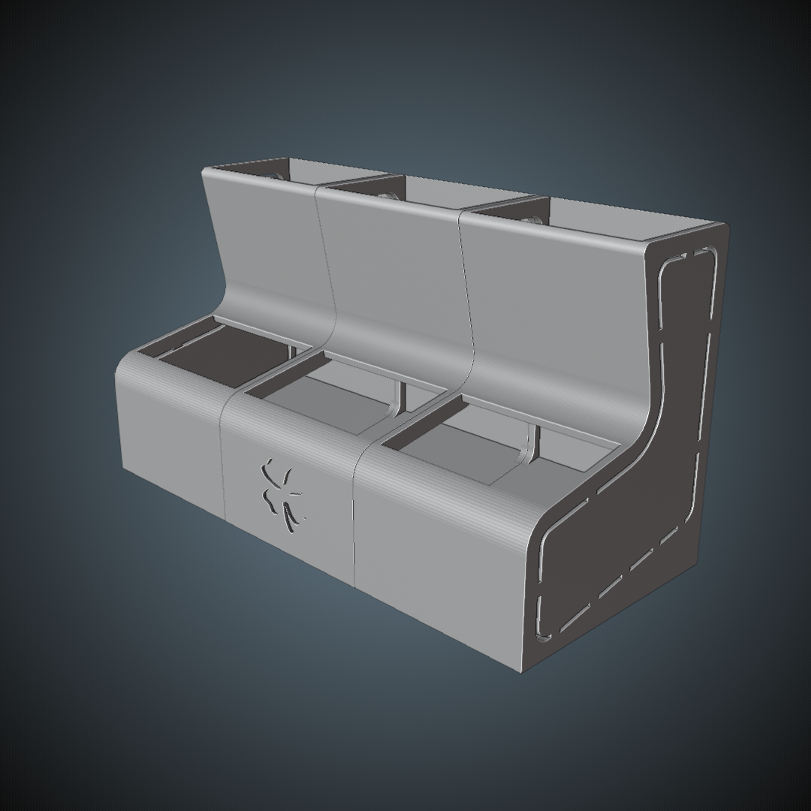

# Customizable Quail Feeder

- Download from Printables here: [`Download Link`](https://www.printables.com/model/1025439-customizable-quail-feeder)
- Download from Thingiverse here: [`Download Link`](https://www.thingiverse.com/thing:6784757)

## Summary

A quail feeder designed to be customized by the number of units needed. Simply print in a weather resistant material, remove one or both sides using wire cutters, and join using glue or plastic weld.

* * *

# Summary

- **Two files are available to download:**
	- Quail Feeder
	- Quail Feeder with Clover decoration

# Print Settings

- Supports: None
- Infill: 5%
- Brim: true

# Bill of Materials

- 

# Assembly

- 

# Additional Information

- **Notes**
	- 
- **Troubleshooting**
	- 
- **Warnings**
	- 

# A Note from the Designer

## Preview

